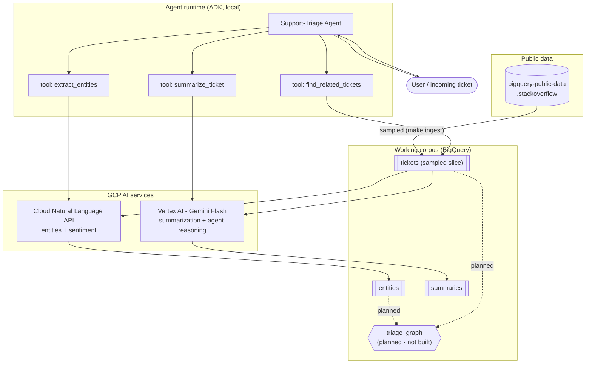
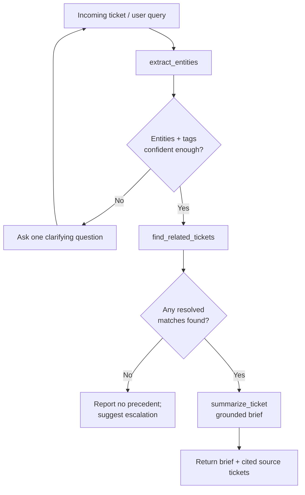
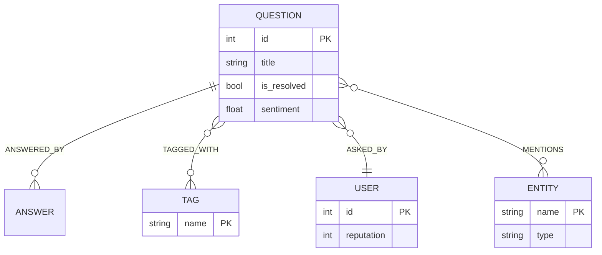

# Architecture

## Scenario

A support team answers variations of the same technical questions repeatedly, and
the knowledge of how each was resolved is scattered across past tickets. The agent
shortens first-response time and keeps answers consistent: given a new ticket it
identifies the core issue, checks whether something similar was resolved before,
and drafts a grounded summary of the likely fix that cites its sources. When no
precedent exists it says so and suggests escalation rather than inventing an
answer.

## Approach

1. **Storage** - a tag-scoped sample of the public Stack Overflow dataset is
   copied into a working BigQuery dataset (cost-bounded; ADR 0001, 0004).
2. **Extraction** - the Cloud Natural Language API produces entities and
   document sentiment per ticket (ADR 0002).
3. **Retrieval** - resolved tickets sharing tags are found by a BigQuery
   **SQL** query (what runs today). The same relationship is *designed* to
   generalize to a GQL property graph for multi-hop traversals, but that graph is
   **not yet built or wired** - it is a near-term improvement (ADR 0003,
   `docs/ROADMAP.md`).
4. **Summarization** - Gemini Flash on Vertex AI produces a grounded brief
   (ADR 0004).
5. **Orchestration** - an ADK agent exposes the above as tools and chains them
   (ADR 0005).

## Agentic workflow

- **Goal:** answer "what is the likely fix for this ticket?" using prior resolved
  tickets, or escalate when there is no precedent.
- **Tools:** `extract_entities` (NL API), `find_related_tickets` (BigQuery SQL
  tag overlap), `summarize_ticket` (Gemini).
- **Reasoning:** extract -> clarify if the ticket is ambiguous -> retrieve ->
  escalate if nothing resolved is found -> summarize with citations.
- **State:** ADK session state within a run; optional Firestore persistence
  across sessions (roadmap).

## Diagrams

All diagrams are Mermaid (render on GitHub, in VS Code, or at mermaid.live).

### High-level GCP topology

### Agent reasoning flow

### Retrieval today, and the property-graph generalization (planned)

What runs today is a BigQuery **SQL** query that ranks resolved tickets by
tag-term overlap with the incoming text - transparent, free, and
unit-tested. The relationship it expresses - resolved questions that share
tags/entities with a ticket, and the users who resolved them - is naturally a
**graph**. A GQL property graph is the multi-hop generalization, and its DDL +
a sample traversal are **scaffolded in `sql/`**, but the graph is **not yet built
and the agent does not call it** (`graph/build.py` is a stub; ADR 0003).

It is the leading near-term improvement because a single-hop tag overlap does not
justify a graph (SQL does it well); the graph earns its place only on **multi-hop**
queries that are awkward as nested SQL - combined tag+entity relevance, *entity-
bridge* precedents (share an entity but no tag, invisible to tag overlap), and
expert routing (ticket -> accepted answer -> answerer -> their other resolved
tickets). *How to explore it:* derive node/edge tables from `tickets`+`entities`,
`CREATE PROPERTY GRAPH`, write the GQL traversals, wire them as the primary path
with the SQL as automatic fallback, and measure recall@k / MRR vs the SQL baseline.
See `docs/ROADMAP.md` and the report's Future Work section. Proposed schema:

## Component to service mapping

| Component | Service | Rationale | ADR |
|-----------|---------|-----------|-----|
| Corpus storage | BigQuery | Dataset already hosted there; serverless; free tier | 0001 |
| Entities + sentiment | Cloud Natural Language API | Managed, deterministic, free units | 0002 |
| Retrieval | BigQuery SQL tag overlap (property graph planned) | Relationship traversal without a new service | 0003 |
| Summarization + agent reasoning | Gemini Flash / Vertex AI | GCP-native, low cost, adequate quality (frontier routing planned) | 0004 |
| Orchestration | ADK | Code-first tools, multi-step reasoning, local dev | 0005 |

## Evaluation

Stack Overflow tags are a free gold standard. Extraction is scored by
precision/recall of extracted entities against a ticket's tags; summaries get a
small qualitative spot-check (faithfulness and usefulness). NL API output and SQL
retrieval are deterministic and snapshot-testable; Gemini output is checked for
properties (non-empty, cites a ticket id, no invented fix) rather than exact text.
