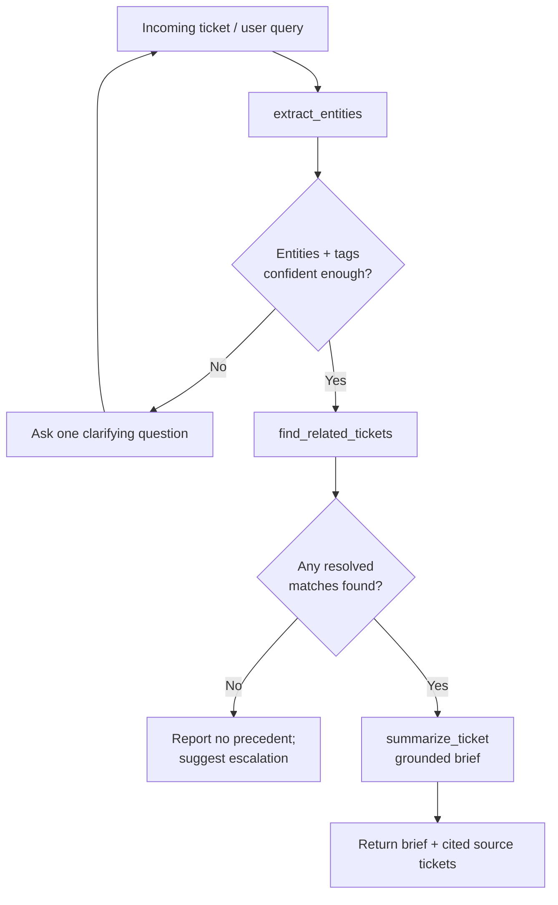
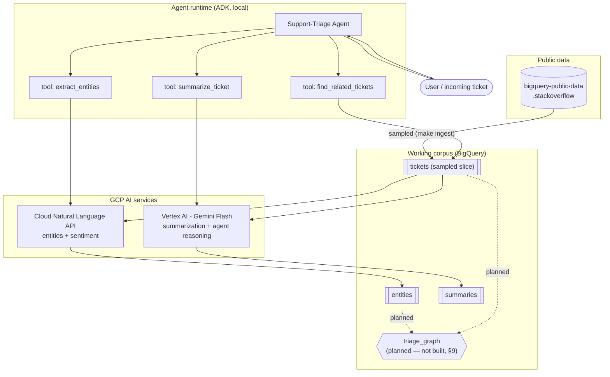
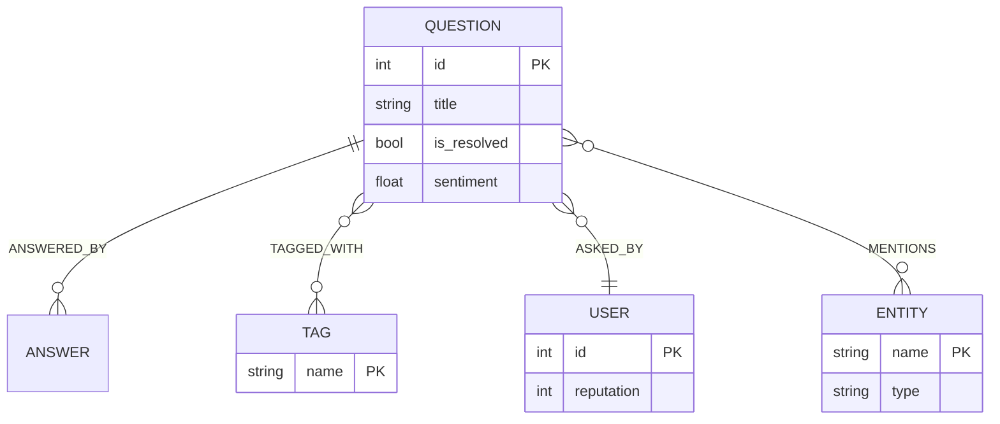

# Architecture & Agent Design Report
## Intelligent Data Extraction & Summarization with Agentic Workflows on GCP
**Prototype:** Support-Triage Agent · **Author:** Mahya Jodeyri Rad · **Date:** 2026-06-10 · **Scope:** ~48-hour prototype

---

## 1. Executive Summary

This prototype is a **Support-Triage Agent**: given an incoming technical support ticket, it (1) **extracts** the core issue, entities and sentiment, (2) **retrieves** historically similar *resolved* tickets, and (3) **summarizes** the likely fix into a grounded brief that **cites its sources**. When no precedent exists, it says so and recommends escalation rather than inventing an answer.

The system is built **GCP-native end to end** — BigQuery (corpus + retrieval), Cloud Natural Language API (extraction), Vertex AI / Gemini Flash (summarization) — and orchestrated as modular **tools behind a Google ADK agent**. What runs today retrieves precedents with a **transparent, free, lexical tag-overlap SQL query** in BigQuery. The data is deliberately modeled as a *relationship* problem so the same retrieval **generalizes to a BigQuery property graph** (GQL multi-hop traversal); that graph is **designed and scaffolded but not yet built or wired** — it is documented as a near-term improvement (§9, ADR 0003), not claimed as working.

The differentiators that *are* delivered: a **rigorous, honest evaluation** (a three-way extraction comparison, a hallucination-discrimination probe, and judge-vs-human calibration — §5), and a **grounded, source-citing, abstaining agent** that refuses to fabricate fixes. Every artifact (sampled corpus, entities, summaries) is **regenerable from a single `make` target or slash command**, and every component choice is recorded in an Architecture Decision Record (ADR).

**Scope discipline:** the work is organized in three phases. **Phase 1 (working)** and **Phase 2 (improved)** are implemented; **Phase 3 (full product)** — managed Agent Engine deployment, cross-session memory, the property-graph and vector hybrid retrieval — is documented as roadmap only (§9–§10). This keeps the prototype honest about what runs today versus what would be added next.

---

## 2. Scenario & Agent Goal

**Business problem.** A support team answers variations of the same technical questions repeatedly, and the knowledge of *how each was resolved* is scattered across thousands of past tickets. First-response time suffers and answers drift in quality.

**Agent goal.** Answer *"What is the likely fix for this ticket?"* by grounding the response in prior **resolved** tickets — shortening first-response time and keeping answers consistent and citable. Explicitly **escalate** when there is no precedent, so the agent never fabricates a fix.

**Why this dataset (ADR 0001).** We model tickets on the **public Stack Overflow dataset** (`bigquery-public-data.stackoverflow`), scoped to the `google-cloud-platform` tag domain. It is already hosted in BigQuery (zero-egress, serverless), and its **tags are a free gold standard** for evaluating extraction. Its structure (questions, answers, tags, users) justifies **relationship-based retrieval**, and "an accepted answer to a resolved question" is a clean proxy for "a known fix."

---

## 3. Task 1 — Data Preparation & Exploration

**Storage (GCP-native).** A **tag-scoped, cost-bounded sample** of the public dataset is copied into a working BigQuery dataset (`support_triage`). Sampling uses `TABLESAMPLE` (~5%) plus a tag filter and a row cap, with column projection — keeping the ingest scan in the low-MB range (ADR 0004).

**Working corpus (actuals in this run):**

| Table | Rows | Notes |
|-------|------|-------|
| `tickets` | **2,894** | sampled questions; `is_resolved` = has an accepted answer |
| of which **resolved** | **1,248** | the retrieval candidate pool |
| `entities` | **7,911** | NL API entities + sentiment, one row per (ticket, entity) |
| `summaries` | **300** | Gemini Flash briefs (provenance: `model` column) |

**Preprocessing.** HTML stripping (`clean_html`), whitespace/code-fence normalization to `body_clean`, and length truncation (`truncate`) so each document stays within one NL API billed unit (~1,000 chars) — both a quality and a cost control.

**EDA.** `make eda` profiles tag frequency, resolved-rate, body length, and score distributions. Representative findings: the corpus is dominated by `google-cloud-functions`, `google-cloud-storage`, `google-bigquery`, `kubernetes`/`google-kubernetes-engine`, `google-app-engine` — confirming enough intra-tag overlap to make tag-based retrieval meaningful, and ~43% resolved (1,248 / 2,894), a healthy precedent pool.

---

## 4. Task 2 — Information Extraction & Summarization

### 4.1 Extraction — Cloud Natural Language API (ADR 0002)

We use the **Cloud Natural Language API** for entity analysis and document sentiment rather than an LLM-extraction path, because it is **managed, deterministic, snapshot-testable, and free** within the standing 5,000-units/month allowance. The `entities` table captures per-entity `salience`, `entity_sentiment_score/magnitude`, and document-level `sentiment_score/magnitude`.

- **Phase 1** used v2 `analyze_entities` with a **mention-frequency salience proxy** (v2 dropped the `salience` field).
- **Phase 2** (current) uses v1 `analyze_entity_sentiment` for **real salience + per-entity sentiment** — surfacing not just *what* a ticket is about but *which* entity the user is frustrated with.

**Two comparison baselines** are scored head-to-head against the NL API in `make eval`, all three emitting the *identical* entity schema (`name, type, salience, …`) so the same metric applies:

- A **traditional NLP baseline** — spaCy `en_core_web_sm` (`extraction/baseline_spacy.py`): fast, offline NER, but no managed sentiment and weaker domain typing.
- An **LLM baseline** — Gemini Flash (`extraction/gemini_extract.py`): one grounded Flash call per ticket asked to return salient entities as JSON. It costs a model call per document, so it is **deliberately capped** (`GEMINI_EVAL_DOCS=50`, Flash-only) to stay inside the free-tier guardrail — the same cost discipline that argues *against* an LLM-extraction production path (ADR 0002). Including it lets us check empirically whether paying for an LLM actually beats the managed API on this corpus (§5.1).

### 4.2 Summarization — Gemini Flash on Vertex AI (ADR 0004)

Summaries are generated by **Gemini 2.5 Flash via Vertex AI** (`vertexai.generative_models` SDK). **Flash, never Pro**, for batch work — adequate quality at a fraction of the cost. The same small model also powers the **agent's own reasoning** (§6): a deliberate cost choice for a 48-hour prototype, not a quality ceiling. The production intent is **tiered routing** — Flash for bulk and simple steps, a **frontier model (Gemini Pro / frontier tier) for complex multi-step agent reasoning** (§9, ADR 0004). Key design choices:

- **Grounded prompt:** "summarize ONLY from the provided ticket; if the resolution is unknown, say so; do not invent fixes." Output is one ~60-word paragraph at `temperature=0.2` for consistency.
- **Source id stored** alongside each summary, so the agent can cite it and the evaluator can check grounding.
- **Thinking-token robustness:** gemini-2.5-flash is a *thinking* model whose reasoning tokens draw from the output budget; too small a cap truncates summaries mid-sentence. We set a generous `max_output_tokens` and add a `_trim_to_last_sentence` safety net so a rare reasoning spike never persists a partial clause.

**Sample output (grounded; note the explicit "resolution is unknown"):**

> **[47999146]** *How do I authenticate GKE to my third-party private docker registry?* — "The user wants to know how to authenticate their GKE Kubernetes cluster to a third-party private Docker registry, not GCP's, to pull images for deploying pods… The resolution for this issue is currently unknown."

---

## 5. Evaluation (Results)

Stack Overflow tags provide a **free gold standard**, enabling one genuine quantitative metric plus a qualitative spot-check, a discrimination probe, and human calibration (`make eval`).

### 5.1 Quantitative — extracted entities vs. tags (3-way comparison)

Micro-averaged precision/recall/F1, scored against each ticket's Stack Overflow tags. Match = token-set overlap between an entity and a tag (so *"Google Cloud"* matches `google-cloud-platform`). **How it was experimented:** all three extractors emit the same entity schema and are scored by the identical metric against the same tag gold standard — a true head-to-head.

| Extractor | Tickets | Precision | Recall | F1 |
|-----------|:-------:|:---------:|:------:|:--:|
| **Cloud Natural Language API** | 300 | 0.174 | **0.778** | 0.285 |
| spaCy `en_core_web_sm` (baseline) | 300 | 0.333 | 0.566 | **0.419** |
| Gemini Flash — LLM (baseline) | 50 | **0.468** | 0.178 | 0.258 |

**Reading the numbers.** The three extractors sit at three distinct points on the precision/recall curve, which is more informative than any single F1:

- **NL API — widest net (recall 0.78).** It surfaces a broad set of real-world entities (products, people, generic nouns), so it *covers* almost every tag but pays in precision — many legitimately-extracted entities simply have no matching curated tag. This high-recall shape is a feature of the measurement, not a defect.
- **spaCy — best balanced F1 (0.42).** A general-purpose NER model lands in the middle and, on this proxy metric, scores highest overall — a useful, honest reminder that a free offline baseline is competitive on lexical overlap.
- **Gemini Flash — highest precision (0.47), lowest recall.** Asked for *salient* entities, the LLM returns a short, confident list, so what it emits aligns well with a tag, but it omits many (recall 0.18). Note it is scored on a **smaller, cost-capped sample (n=50 vs 300)**, so the comparison is directional, not a like-for-like leaderboard.

**The decision this supports.** No extractor dominates, and the LLM does **not** beat the managed API on this corpus — yet it is the only one that costs a model call per document. That empirically reinforces ADR 0002: for the production extraction path we keep the **managed, deterministic, free, snapshot-testable** NL API (which also gives sentiment for free), and treat the LLM as a comparison baseline rather than the default. The metric is **summary-independent and stable across runs**, making it a reliable regression signal in CI.

### 5.2 Qualitative — summary faithfulness & usefulness (Gemini-Flash LLM judge)

**How it was experimented:** a **20-summary** spot-check scores each summary 1–5 for **faithfulness** (every claim supported by the ticket; no invented fixes) and **usefulness** (would it help an engineer triage), sampled across the summary-length range (not cherry-picked). Current run: **mean 4.80/5 faithfulness, 4.85/5 usefulness**. The judge is not blindly generous — it penalised one summary to **1/5** for inventing a specific error message absent from the ticket, and docked others for naming a platform the ticket never stated.

### 5.3 Does the judge actually catch hallucinations? (discrimination probe)

A top-heavy score is only trustworthy if the metric *moves* when the summary lies. So 5 real summaries were re-scored after **injecting one fabricated fix** absent from the ticket. A faithfulness metric worth anything must penalise the corrupted version:

> Mean faithfulness dropped **5.00 → 1.00 / 5**, and the injected lie was caught in **5 / 5** cases.

This is the key evidence that the qualitative metric is measuring grounding rather than rubber-stamping.

**Calibrated against human labels.** A complementary harness (`judge_calibration`) scores the Gemini judge against **20 independent human faithful/useful labels** (`reference_labels.jsonl`), so the spot-check is anchored to a human rater rather than self-graded. Agreement is close:

| Axis | MAE | Within 1 | Exact |
|------|:---:|:--------:|:-----:|
| Faithful | 0.40 | 0.90 | 0.75 |
| Useful | 0.35 | 0.95 | 0.75 |

The judge lands within 1 point of the human label **90–95%** of the time (MAE ≤ 0.4 on a 1–5 scale), which is the quantitative justification for trusting the spot-check means above.

**Honest caveat.** The spot-check is a **Gemini-judging-Gemini** check, so absolute scores carry some **self-judge leniency**. Two safeguards mitigate this: the discrimination probe shows the judge demonstrably catches injected fabrications, and the calibration harness anchors the judge to **independent human labels**. §10 describes how a production eval would scale the human-rated set and add a fully independent judge model.

### 5.4 Phase-2 metric deliberately deferred — ROUGE-L vs. accepted answers

The harness scaffolds `rouge_vs_accepted()` but **does not run it**, for three defensible reasons: (1) **semantic mismatch** — current summaries summarize the *question/issue* ("resolution unknown"), so ROUGE against an *accepted answer* would score the wrong thing; (2) **cost** — accepted-answer bodies were never ingested, and scanning the multi-GB `posts_answers.body` column would break the free-tier guardrail; (3) summarization of *resolutions* is itself a Phase-2+ feature (§9). The rationale is encoded in code so the deferral is explicit, not an omission.

---

## 6. Task 3 — Agentic System Design

### 6.1 Tools (modular, thin, independently testable)

The agent is a single **ADK root agent** (`gemini-2.5-flash` — same cost-driven Flash choice as §4.2; frontier-model routing is the production plan, §9) exposing the pipeline as three tools. Each tool is a thin wrapper over an importable `src/` module, and **the docstring is the tool description the model reads**:

| Tool | Backing service | Contract |
|------|-----------------|----------|
| `extract_entities(ticket_text)` | Cloud NL API | `{entities:[{name,type,salience,…}], sentiment}` |
| `find_related_tickets(ticket_text, top_k)` | BigQuery (SQL tag overlap) | `[{id, title, shared_tags, score, url}]` or `[]` |
| `summarize_ticket(ticket_text)` | Vertex AI / Gemini Flash | one grounded paragraph |
| *(Future — §9)* `get_resolution` / cross-doc synthesis | BigQuery + Gemini | "known issue & likely fix" citing multiple ids |

**Reliability contract:** tools return `[]`/empty gracefully on expected-empty cases (e.g., no precedent) and never raise into the agent loop — letting the agent *reason* about "no precedent → escalate" rather than crash.

### 6.2 Reasoning / planning

The agent's instruction enforces: **treat the user's message as the ticket** → `extract_entities` → `find_related_tickets` → **ground the answer only in retrieved resolved tickets, citing every id/url** → if nothing comes back, **state no precedent and suggest escalation** → never invent a fix or a ticket id. It asks a single clarifying question only when the message has no technical content.

**Agent reasoning flow:**

### 6.3 State & memory

- **In-session:** ADK session state holds extracted entities and retrieved candidates within a run (the agent "remembers" across tool calls in one conversation).
- **Cross-session (Future / roadmap, §9):** persist turns to **Firestore** (`triage_sessions`) keyed by user/thread, so a returning user's prior tickets and resolutions are recalled. **Memorystore** would back low-latency working memory; **BigQuery** remains the long-term analytical store. Agent Engine **Memory Bank** is the managed Phase-3 upgrade — documented, not built.

### 6.4 Verified end-to-end behavior

Run locally with `adk web src/support_triage/agent`. A live trace for *"What's the likely fix for a ticket about Cloud Functions in Python failing to access Cloud Storage buckets?"*:

- Agent called `extract_entities` → `find_related_tickets` (no hallucinated steps).
- Retrieved a **real, topically-exact** resolved ticket — **#56312091** *"Accessing google cloud storage bucket from cloud functions throws 500 error"* (3 shared tags) — and **cited its id + URL**.
- A weaker query (Cloud Run 503s, only a single shared `gcp` tag) correctly produced **"no precedent → escalate"** rather than a fabricated fix — the grounding guardrail working as designed.

---

## 7. High-Level GCP Architecture

**Retrieval today, and the property-graph generalization (planned, §9).** What runs is a BigQuery **SQL** query that ranks resolved tickets by tag-term overlap with the incoming text — transparent, free, and unit-tested. The relationship it expresses — *"resolved questions that share tags/entities with this ticket, and the users who resolved them"* — is naturally a **graph**. A **GQL property graph** (`CREATE PROPERTY GRAPH` + `GRAPH_TABLE/MATCH`) is the multi-hop generalization; its DDL and a sample traversal are **scaffolded in `sql/` but the graph is not yet built and the agent does not call it** (`graph/build.py` is a stub; ADR 0003). It is the leading near-term improvement (§9). Proposed graph schema:

### Component → service mapping

| Component | GCP service | Why chosen | ADR |
|-----------|-------------|-----------|-----|
| Corpus storage | **BigQuery** | Dataset already hosted there; serverless; free tier | 0001 |
| Entities + sentiment | **Cloud Natural Language API** | Managed, deterministic, free units, snapshot-testable | 0002 |
| Retrieval | **BigQuery SQL tag overlap** *(property graph planned, §9)* | Relationship traversal with no new service to operate | 0003 |
| Summarization + agent reasoning | **Vertex AI — Gemini Flash** | GCP-native, low cost, adequate quality (frontier routing planned) | 0004 |
| Orchestration | **Google ADK** | Code-first tools, multi-step reasoning, local dev/demo | 0005 |
| Cross-session memory | **Firestore** *(roadmap)* | Serverless document store keyed by session | 0005 |

---

## 8. Results, Challenges & Trade-offs

**What works today.** A fully reproducible pipeline (ingest → extract → summarize → agent → eval), an ADK agent that calls real tools and cites real ticket ids, and a quantitative extraction metric plus a calibrated, discrimination-tested summary eval.

**Key trade-offs (each recorded as an ADR):**

1. **NL API over LLM extraction (0002).** Chose determinism, zero cost, and testability over an LLM's flexibility. Trade-off: fixed entity taxonomy. *v2's dropped `salience` field* was the surprise — handled with a mention-frequency proxy, then resolved by moving to v1 entity-sentiment in Phase 2. This is now **empirically backed**: a Gemini Flash extractor, scored head-to-head (§5.1), does not beat the managed API on the corpus despite costing a model call per document.
2. **SQL retrieval today; graph deferred (0003).** Retrieval runs as a transparent, free **lexical tag-overlap SQL** query. The property graph is the elegant multi-hop generalization and is **scaffolded (DDL + GQL traversal written) but not built or wired** — `graph/build.py` is a stub and the agent uses the SQL path. We kept the design seam without claiming a Pre-GA feature works (§9).
3. **Text-overlap retrieval, not vectors (current).** `find_related_by_text` ranks resolved tickets by tag-term overlap with the incoming free text. It's transparent and free but **lexical** — prose phrasing retrieves weakly versus tag-like phrasing. Hybrid semantic retrieval (Vertex embeddings + Vector Search) is a documented upgrade (§9).
4. **Gemini Flash, never Pro (0004).** Quality-for-cost for summarization *and* the agent's reasoning; the **thinking-token output-budget** behavior was the main engineering gotcha (truncated summaries *and* a truncated eval-judge JSON), solved with generous caps, sentence-trimming, and tolerant score-parsing. Frontier-model routing for complex agent turns is the production plan (§9).
5. **Local ADK, not Agent Engine (0005).** Develop and demo locally for a 48-hour scope; managed deployment is a productionization narrative, not prototype work.

**Honest limitations.** Lexical retrieval; the property graph is scaffolded but not wired; some self-judge leniency in the qualitative eval (mitigated by the discrimination probe and human calibration); small, cost-bounded sample; summaries describe issues rather than synthesizing resolutions across precedents (the `summarize_cluster` / `get_resolution` tools are scaffolded but not yet wired).

---

## 9. Future Work

The prototype is intentionally bounded; these are the highest-value extensions, in priority order. Several are scaffolded in the repo (DDL, stubbed tools) so the seams already exist.

### 9.1 Property-graph multi-hop retrieval (designed, not built) — the leading improvement

**Current state.** Retrieval is a single-hop lexical tag-overlap SQL query. The graph DDL (`sql/02_create_graph.sql`), a sample GQL traversal (`sql/03_graph_traversals.sql`), and a `use_graph` code path (`graph/queries.py`) exist, but `graph/build.py` is a stub and the agent never calls the graph — so **no graph is built and nothing uses it today**.

**Why it adds value.** A single-hop tag overlap does *not* justify a graph — SQL does it well. A property graph earns its place only on **multi-hop** questions that are awkward as nested SQL self-joins:
- **(i) Combined tag + entity relevance** — rank precedents by shared tags *and* shared extracted entities in one traversal, weighting the more specific entity matches.
- **(ii) Entity-bridge precedents** — resolved tickets that share an *entity* but **no tag** with the incoming ticket. These are invisible to tag-overlap SQL, yet are exactly the non-obvious precedents that help.
- **(iii) Expert routing** — *ticket → accepted answer → answerer → that expert's other resolved tickets*, to suggest a likely resolver. A genuinely 2-hop traversal.

**How to explore it.** Derive node/edge tables from `tickets` + `entities`; run `CREATE PROPERTY GRAPH`; write the multi-hop GQL traversals; wire the agent's retrieval to the graph as the **primary path with the current SQL as an automatic fallback** (BigQuery Graph is Pre-GA). Crucially, **measure** it: build a small labeled related-set and report **recall@k / MRR** for the graph vs the SQL baseline, plus a count of entity-bridge precedents SQL never surfaces — so the graph is justified with numbers, not asserted. Expert routing (iii) additionally needs the accepted-answer author, which requires the answer re-ingest in §9.2.

### 9.2 Agentic improvements

- **Cross-document synthesis (`summarize_cluster`).** Given several retrieved precedents, produce one "known issue & likely fix" brief that cites *every* source id and refuses when evidence is weak — the assignment's core "across multiple documents" ask.
- **`get_resolution` + true resolution summaries.** Re-ingest accepted-answer text (join `posts_answers` on `accepted_answer_id`), add a tool to fetch it, and summarize the *resolution* rather than the question — closing today's "resolution unknown" gap and unlocking the deferred **ROUGE-L vs. accepted answers** metric (§5.4).
- **Hybrid semantic retrieval.** Add Vertex AI embeddings + Vector Search alongside lexical/graph retrieval for fuzzy phrasing, ranked together.
- **Frontier-model routing.** Tiered model selection — Flash for bulk/simple steps, a **frontier model (Gemini Pro/frontier tier) for complex multi-step reasoning turns** — instead of Flash everywhere.
- **Multi-agent decomposition.** A supervisor agent over specialist sub-agents (retriever, summarizer, resolver) via ADK's multi-agent API.
- **Cross-session memory.** Persist turns to Firestore (§6.3) so a returning user's history informs triage.
- **Confidence-aware clarify / abstain.** An explicit low-confidence path that asks one targeted clarifying question or abstains, driven by extraction salience and retrieval score.
- **Retrieval-quality evaluation in CI.** Once the graph lands, add recall@k / MRR as a regression gate alongside the extraction and summary metrics.

---

## 10. Productionization Approach (conceptual)

How this prototype would extend to real-world deployment:

**Scalability & orchestration.** Replace `make` targets with **Vertex AI Pipelines** for the batch extract/summarize/graph-build DAG (versioned, scheduled, cached). Drive **event-driven ingestion** with **Pub/Sub** (a new ticket → topic) and **Cloud Functions / Cloud Run** for per-ticket extraction and summarization, scaling to zero between bursts. Promote the agent from local ADK to **Vertex AI Agent Engine** (managed runtime, autoscaling, tracing).

**Security & data privacy.** Least-privilege **IAM** per component (separate service accounts for ingest, extraction, agent); **CMEK** encryption on BigQuery/GCS; **VPC Service Controls** to prevent exfiltration; **Cloud DLP** to redact PII from tickets before they reach the LLM; **Secret Manager** for any credentials. All config already comes from env vars — **no hard-coded project ids or secrets**.

**Monitoring, logging & error handling.** **Cloud Logging** for structured tool traces, **Cloud Monitoring** dashboards + alerts on tool error-rate, p95 latency, and **groundedness** (share of answers citing a real ticket). Calls already use **retry/backoff** (`with_backoff`); add dead-letter queues for failed extractions and a circuit-breaker that degrades the graph path to SQL (already designed in).

**Cost management.** The free-tier guardrails (ADR 0004) become budget controls: BigQuery **`--dry-run` byte checks** in CI, NL API document caps, **Flash-by-default with frontier routing only for hard turns**, batch-mode (50% off) for bulk jobs, embedding/summary **caching** to avoid recomputation, and **BigQuery slot reservations** only if volume warrants. Per-tool cost is logged as a label for showback.

**CI/CD & reproducibility.** A **lint → unit-test → evaluation-gate → deploy** pipeline (the eval harness becomes a quality gate that blocks regressions in extraction F1 / summary groundedness / retrieval recall). Pinned dependencies (`requirements-lock.txt`), containerized jobs, **prompt + model versioning** with the model recorded per artifact (already done — `summaries.model`). Every artifact regenerable from a single command — the prototype's core discipline scales directly into production.

---

## 11. Reproducibility & Repository

Everything that runs today is regenerable; no manual console clicking. Configuration is entirely env-driven (`.env` / `.env.example`).

| Step | Command | Output |
|------|---------|--------|
| Sample corpus | `make ingest` | `tickets` table |
| Explore | `make eda` | EDA profile |
| Extract | `make extract` | `entities` table |
| Summarize | `make summarize` | `summaries` table |
| Run agent | `adk web src/support_triage/agent` / `make run-agent` | local agent UI |
| Evaluate | `make eval` | metrics + `eval_results.md` |
| *(scaffolded, not yet functional)* Build graph | `make build-graph` | property graph — see §9.1; `graph/build.py` is a stub |

**ADR index:** 0001 dataset choice · 0002 NL API vs LLM extraction · 0003 graph vs vector retrieval · 0004 cost & model selection · 0005 ADK orchestration.

**Stack:** Python ≥3.11, ADK 2.2.0, `google-cloud-bigquery`, `google-cloud-language`, `vertexai`; `ruff` for lint/format; type hints + docstrings throughout.

**GCP resources required:** a project with BigQuery, Cloud Natural Language API, and Vertex AI enabled; `gcloud` auth; ~free-tier footprint.
